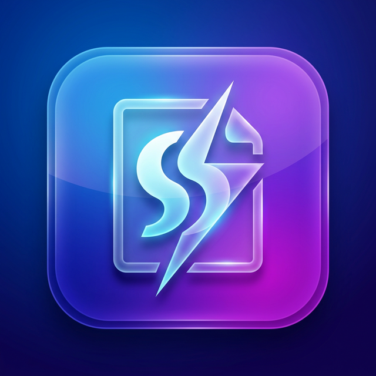
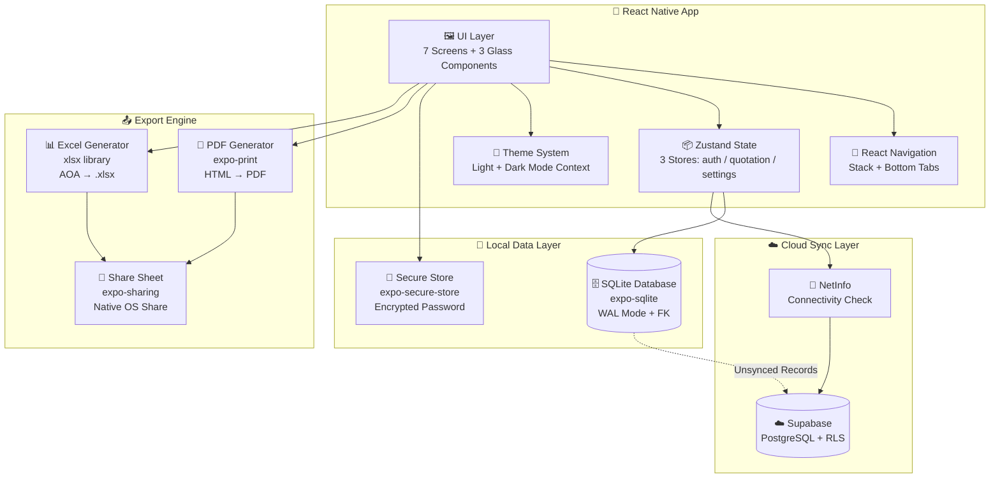
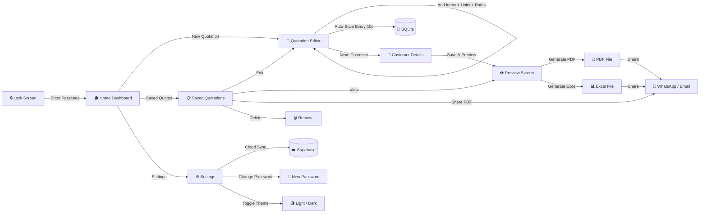
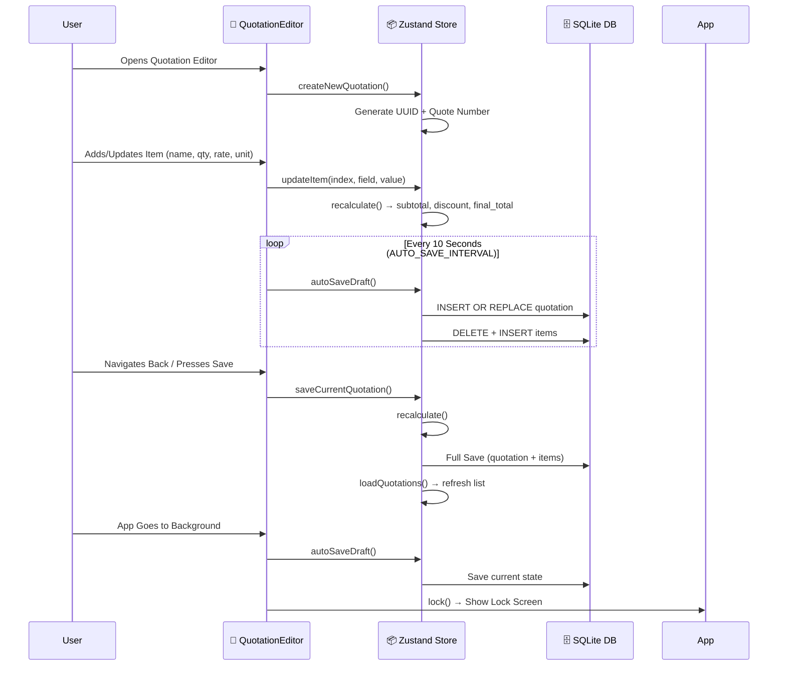
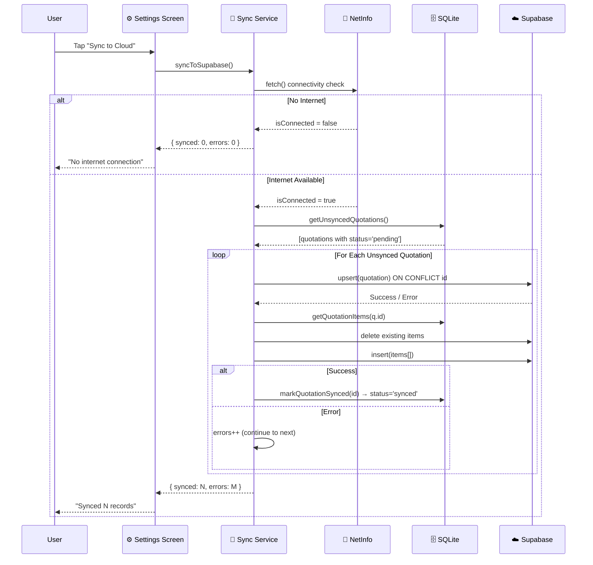
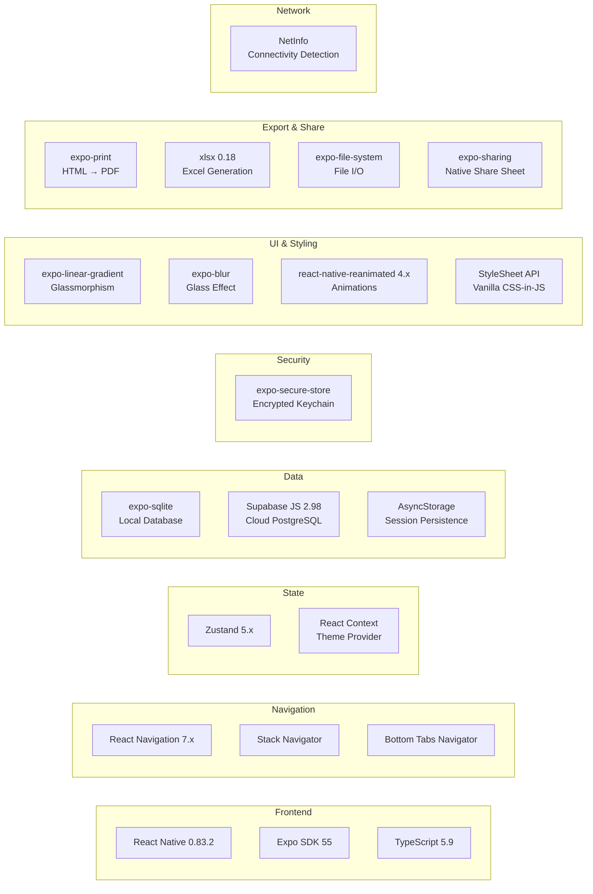
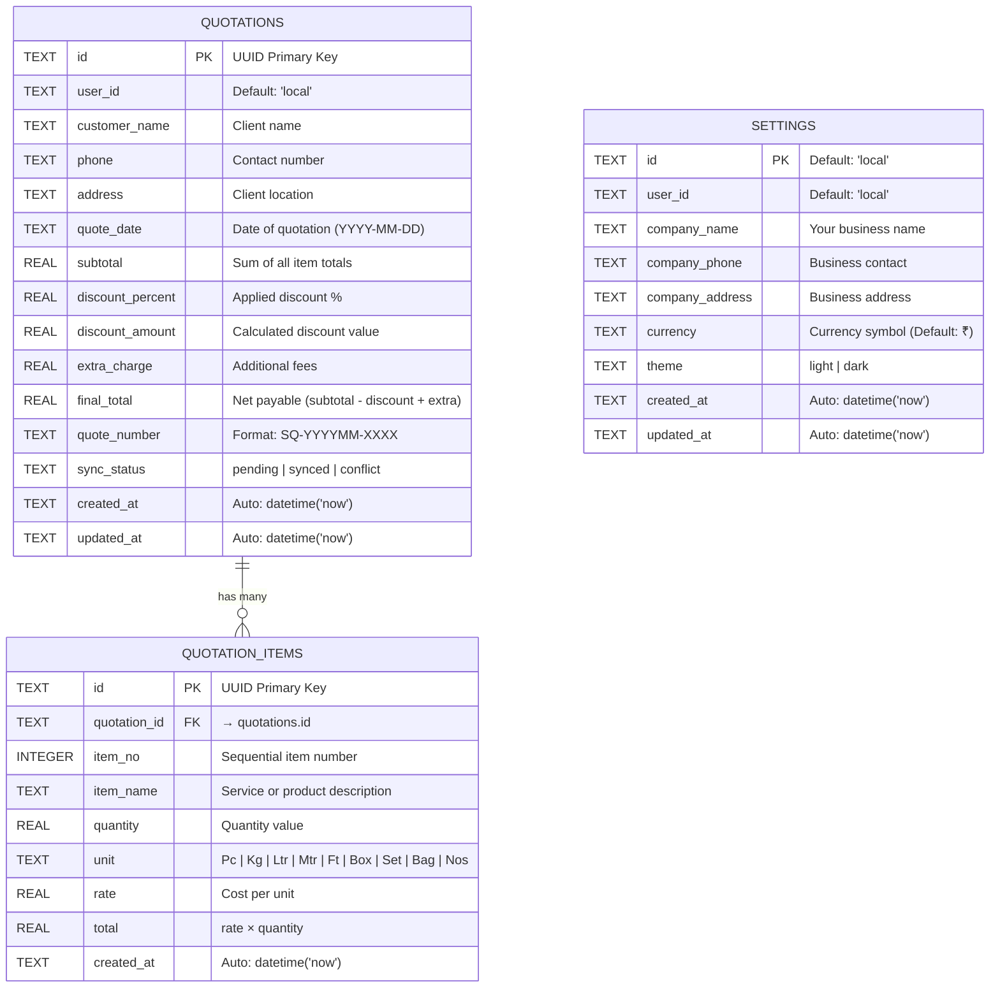
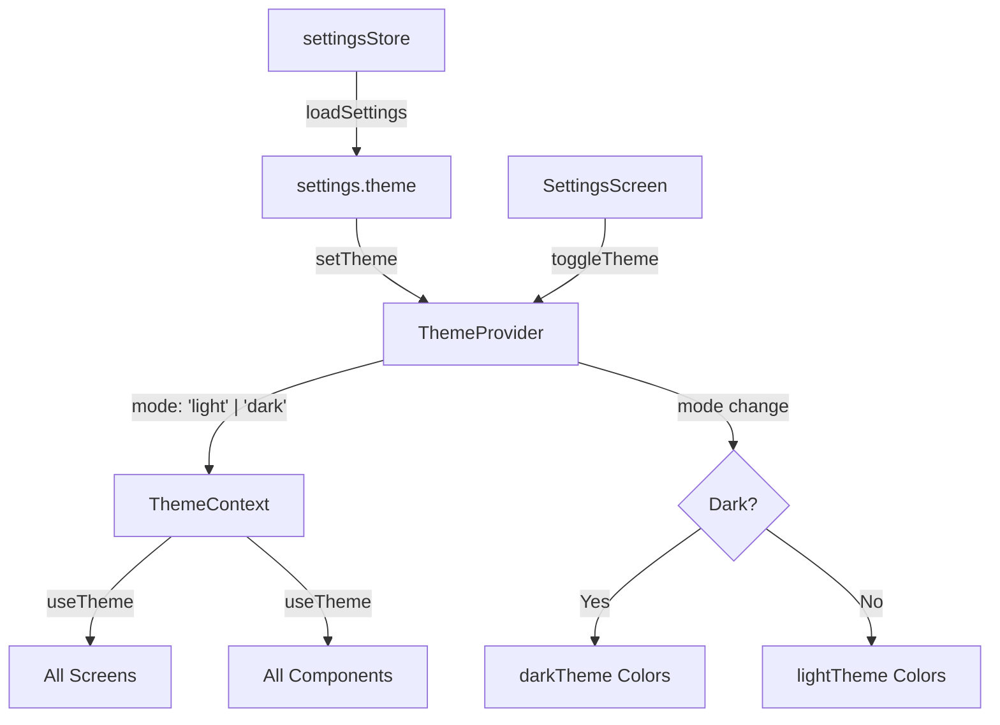
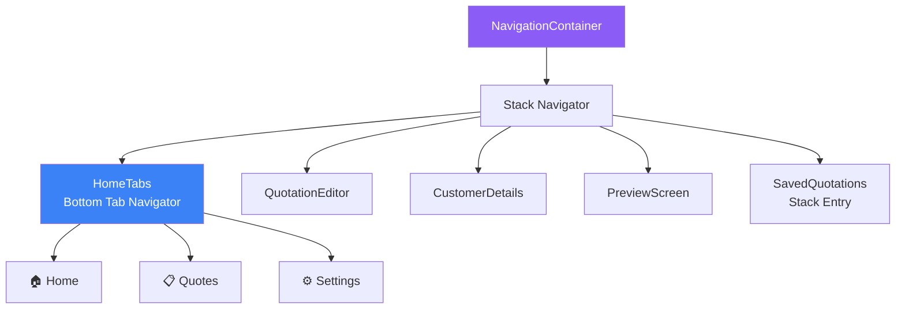
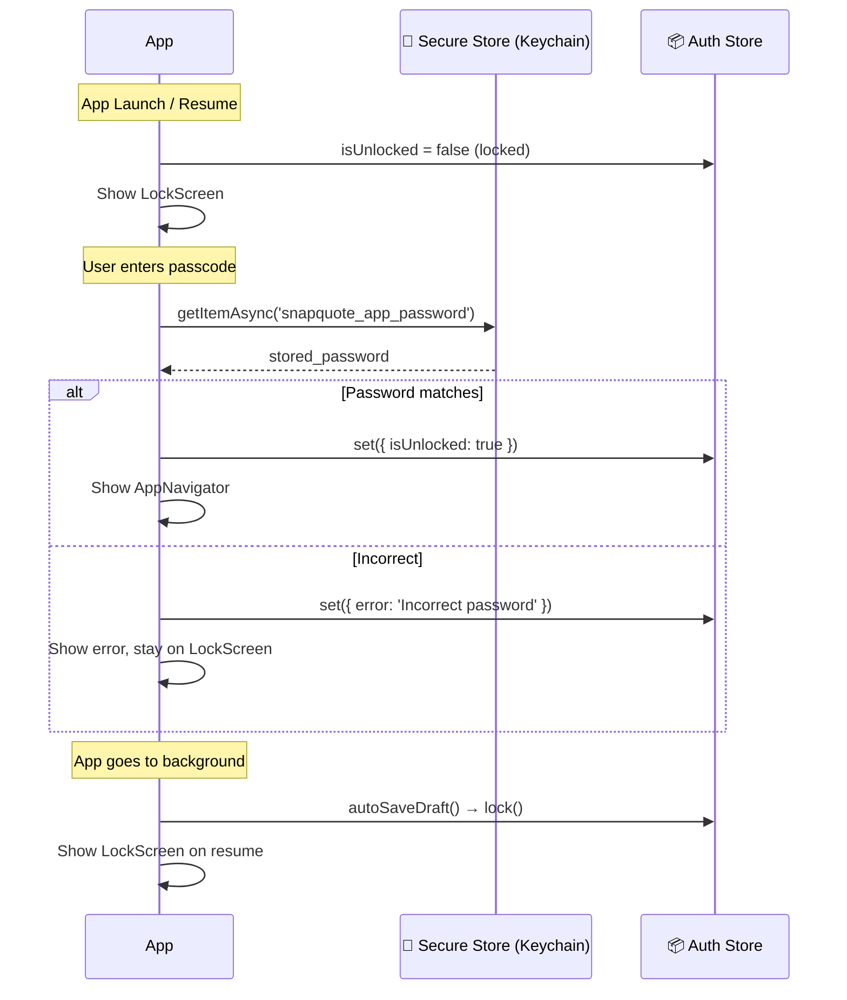

<p align="center">
  
</p>

<h1 align="center">⚡ SnapQuote</h1>

<p align="center">
  <strong>Professional Quotations & Invoices — Created in Under 60 Seconds</strong>
</p>

<p align="center">
  
  
  
  
  
  
</p>

<p align="center">
  <em>A premium, offline-first mobile application designed for freelancers, contractors, and small business owners to quickly generate, manage, and share professional quotations and invoices.</em>
</p>

<p align="center">
  Built with a stunning <strong>"Liquid Glass" UI</strong> design language, secure passcode-based app locking, and seamless background cloud synchronization via Supabase.
</p>

---

## 📑 Table of Contents

- [Core Features](#-core-features)
- [Screenshots & UI/UX Design](#-screenshots--uiux-design)
- [Architecture & Data Flow](#-architecture--data-flow)
- [PRD — Product Requirements Document](#-prd--product-requirements-document)
- [TRD — Technical Requirements Document](#-trd--technical-requirements-document)
- [Project Structure](#-project-structure)
- [Database Schema](#-database-schema)
- [Screen-by-Screen Documentation](#-screen-by-screen-documentation)
- [Component Library](#-component-library-liquid-glass-design-system)
- [State Management](#-state-management-zustand-stores)
- [Services & Business Logic](#-services--business-logic)
- [Theme System](#-theme-system)
- [TypeScript Type Definitions](#-typescript-type-definitions)
- [Navigation Architecture](#-navigation-architecture)
- [Build & Deployment](#-build--deployment)
- [Local Setup & Installation](#-local-setup--installation)
- [Environment & Configuration](#-environment--configuration)
- [Security Practices](#-security-practices)
- [API Reference](#-api-reference-sqlite-data-layer)
- [Contributing](#-contributing)
- [License](#-license)

---

## 🌟 Core Features

| Feature | Description |
|---------|-------------|
| 🚀 **60-Second Quoting** | Hyper-optimized UI to add items, specify units (Pc, Kg, Ltr, Mtr, Ft, Box, Set, Bag, Nos), and calculate totals instantly |
| 📱 **Offline-First** | Works 100% without internet. All data saved locally in SQLite |
| ☁️ **Cloud Sync** | One-tap synchronization with Supabase PostgreSQL when online |
| 📄 **PDF Export** | Generate pixel-perfect, professionally styled PDF quotation slips |
| 📊 **Excel Export** | Generate `.xlsx` spreadsheets with full quotation data for corporate clients |
| 📤 **One-Tap Sharing** | Share PDFs/Excel directly via WhatsApp, Email, or any app using native share sheet |
| 🔒 **Secure App Lock** | Built-in passcode protection with encrypted storage via `expo-secure-store`. Auto-locks when app goes to background |
| 💾 **Auto-Save Drafts** | In-progress quotes are saved automatically every **10 seconds** to local DB |
| 🎨 **Liquid Glass UI** | Premium glassmorphism visual experience with both **Pure White** and **Pure Dark** themes |
| 🔍 **Search & Filter** | Real-time search through saved quotations by customer name or quote number |
| 💰 **Smart Calculations** | Automatic subtotal, discount (%), extra charges, and final total computation |
| 🏢 **Company Branding** | Set your company name, phone, and address — automatically appears on all generated PDFs |

---

## 🎨 Screenshots & UI/UX Design

SnapQuote is built with a stunning **Liquid Glass** aesthetic. Here are some of the core screens from the design phase:

<table>
  <tr>
    <td align="center"><b>Quotation Editor</b><br></td>
    <td align="center"><b>Customer Details</b><br></td>
  </tr>
  <tr>
    <td align="center"><b>Saved Quotations</b><br></td>
    <td align="center"><b>Settings & Sync</b><br></td>
  </tr>
</table>

### Design Philosophy — "Liquid Glass"

SnapQuote uses a **Liquid Glass** design language that prioritizes:

- **Glassmorphism** — Semi-transparent cards with blur effects and subtle borders
- **Linear Gradients** — Header bars use accent-to-purple gradients (`#3B82F6` → `#8B5CF6`)
- **Floating Navigation** — Bottom tab bar is a floating pill with rounded corners, elevated off the screen edge
- **Micro-Animations** — Animated lock screen with Reanimated-powered fade and scale transitions
- **Adaptive Theming** — Every component adapts between `light` (Pure White) and `dark` (Pure Black) modes
- **Elevated Cards** — Light mode uses shadow elevation; dark mode uses subtle glass borders

### Color Palette

| Token | Light Mode | Dark Mode | Purpose |
|-------|-----------|-----------|---------|
| `background` | `#FFFFFF` | `#000000` | Base screen color |
| `card` | `#F8F9FA` | `#0F0F0F` | Card background |
| `cardAlt` | `#F0F4FF` | `#1A1A2E` | Alternate card (stats) |
| `glass` | `rgba(255,255,255,0.75)` | `rgba(255,255,255,0.08)` | Glass overlay |
| `glassBorder` | `#E5E7EB` | `rgba(255,255,255,0.15)` | Glass card border |
| `text` | `#111111` | `#FFFFFF` | Primary text |
| `textSecondary` | `#6B7280` | `#9CA3AF` | Secondary / label text |
| `accent` | `#3B82F6` | `#3B82F6` | Primary accent (blue) |
| `accentLight` | `rgba(59,130,246,0.12)` | `rgba(59,130,246,0.15)` | Accent background |
| `gradientStart` | `#3B82F6` | `#3B82F6` | Gradient left |
| `gradientEnd` | `#8B5CF6` | `#8B5CF6` | Gradient right |
| `error` | `#EF4444` | `#EF4444` | Error / danger |
| `success` | `#16A34A` | `#16A34A` | Success actions |
| `warning` | `#F59E0B` | `#F59E0B` | Warning states |
| `inputBg` | `#FFFFFF` | `rgba(255,255,255,0.08)` | Input field background |

---

## 🏗 Architecture & Data Flow

### 1. High-Level System Architecture



### 2. User Flow — Complete Quotation Lifecycle



### 3. State Management & Auto-Save Flow



### 4. Cloud Sync Architecture



---

## 📝 PRD — Product Requirements Document

### Problem Statement

Small business owners, freelancers, and contractors rely on slow, manual methods (pen & paper, complex desktop software like Excel/Tally) to create quotations. They need a **mobile-first tool** that is:

1. **Ultra-fast** — Create a complete quotation in < 60 seconds
2. **Visually professional** — Generated PDFs must impress clients
3. **Works offline** — Many users operate in low/no connectivity areas
4. **Secure** — Financial data must be protected from unauthorized access
5. **Simple to share** — One-tap sharing via WhatsApp (the primary business communication tool in India)

### Target Audience

| Segment | Examples | Key Needs |
|---------|----------|-----------|
| **Freelancers** | Web Designers, Photographers, Consultants | Quick professional quoting |
| **Contractors** | Electricians, Plumbers, Carpenters, Painters | On-site estimations |
| **Small Retailers** | Shops, Wholesale Distributors | Bulk item pricing |
| **Service Providers** | Caterers, Event Planners, Tutors | Service-based billing |

### User Epics & Stories

#### Epic 1: Quotation Generation
| Story ID | User Story | Acceptance Criteria |
|----------|-----------|-------------------|
| QG-01 | As a user, I want to add multiple items with varying names, units, and rates | ✅ Support for 9 unit types (Pc, Kg, Ltr, Mtr, Ft, Box, Set, Bag, Nos) |
| QG-02 | As a user, I want the total to auto-calculate as I type | ✅ Real-time `quantity × rate` per item, auto-subtotal |
| QG-03 | As a user, I want to apply a percentage discount | ✅ Discount % → discount amount → discounted subtotal |
| QG-04 | As a user, I want to add extra charges (shipping/handling) | ✅ Extra charge added after discount |
| QG-05 | As a user, I want to enter customer details (name, phone, address) | ✅ Separate Customer Details screen |
| QG-06 | As a user, I want a unique quote number auto-generated | ✅ Format: `SQ-YYYYMM-XXXX` (e.g., `SQ-202603-4821`) |

#### Epic 2: Export & Sharing
| Story ID | User Story | Acceptance Criteria |
|----------|-----------|-------------------|
| ES-01 | As a user, I want to download a PDF with my company branding | ✅ Company name, phone, address in PDF header |
| ES-02 | As a user, I want to share the PDF via WhatsApp/Email | ✅ Native share sheet integration |
| ES-03 | As a user, I want to export raw data as an Excel file | ✅ `.xlsx` with proper column widths |
| ES-04 | As a user, I want a professional PDF layout | ✅ Styled HTML template with gradient header, lined items, summary |

#### Epic 3: Security & Privacy  
| Story ID | User Story | Acceptance Criteria |
|----------|-----------|-------------------|
| SP-01 | As a user, I want to lock the app with a password | ✅ Passcode stored encrypted via `expo-secure-store` |
| SP-02 | As a user, I want auto-lock when the app goes to background | ✅ `AppState` listener triggers `lock()` + `autoSaveDraft()` |
| SP-03 | As a user, I want to change my password | ✅ Settings screen → Change Password with validation |

#### Epic 4: Data Reliability
| Story ID | User Story | Acceptance Criteria |
|----------|-----------|-------------------|
| DR-01 | As a user, I want my data to persist even without internet | ✅ SQLite local storage (WAL mode) |
| DR-02 | As a user, I want to sync data to the cloud | ✅ One-tap Supabase sync with upsert strategy |
| DR-03 | As a user, I want in-progress work saved automatically | ✅ Auto-save every 10 seconds + save on background |

#### Epic 5: Personalization
| Story ID | User Story | Acceptance Criteria |
|----------|-----------|-------------------|
| PZ-01 | As a user, I want to switch between light and dark themes | ✅ React Context-based theme toggle |
| PZ-02 | As a user, I want to set my preferred currency | ✅ Configurable currency symbol (default: `₹`) |
| PZ-03 | As a user, I want my settings to persist | ✅ Settings stored in SQLite `settings` table |

### Version Roadmap

| Version | Status | Features |
|---------|--------|----------|
| `v1.0.0` | ✅ **Released** | Core quoting, PDF/Excel export, app lock, cloud sync, dark/light theme |
| `v1.1.0` | 🔜 Planned | Biometric unlock (Fingerprint/Face ID), Invoice numbering |
| `v1.2.0` | 🔜 Planned | Client database, recurring quotations, template system |
| `v2.0.0` | 🔜 Planned | Multi-user accounts, team collaboration, cloud-first architecture |

---

## ⚙️ TRD — Technical Requirements Document

### Technology Stack



### Complete Dependency Table

| Package | Version | Purpose | Category |
|---------|---------|---------|----------|
| `react` | `19.2.0` | UI library | Core |
| `react-native` | `0.83.2` | Native mobile framework | Core |
| `expo` | `~55.0.4` | Managed workflow platform | Core |
| `typescript` | `~5.9.2` | Static type checking | Core |
| `@react-navigation/native` | `^7.1.33` | Navigation container | Navigation |
| `@react-navigation/stack` | `^7.8.4` | Stack navigator with transitions | Navigation |
| `@react-navigation/bottom-tabs` | `^7.15.5` | Bottom tab navigation | Navigation |
| `react-native-screens` | `~4.23.0` | Native screen containers | Navigation |
| `react-native-safe-area-context` | `~5.6.2` | Safe area insets | Navigation |
| `react-native-gesture-handler` | `~2.30.0` | Gesture recognition | Navigation |
| `zustand` | `^5.0.11` | Lightweight state management | State |
| `expo-sqlite` | `~55.0.10` | Local SQLite database | Data |
| `@supabase/supabase-js` | `^2.98.0` | Cloud database client | Data |
| `@react-native-async-storage/async-storage` | `2.2.0` | Key-value storage | Data |
| `@react-native-community/netinfo` | `11.5.2` | Network connectivity info | Network |
| `expo-secure-store` | `~55.0.8` | Encrypted credential storage | Security |
| `expo-print` | `~55.0.8` | HTML to PDF conversion | Export |
| `xlsx` | `^0.18.5` | Excel file generation | Export |
| `expo-file-system` | `~55.0.10` | File read/write operations | Export |
| `expo-sharing` | `~55.0.11` | Native share dialog | Export |
| `expo-linear-gradient` | `~55.0.8` | Gradient backgrounds | UI |
| `expo-blur` | `~55.0.8` | Blur/glass effects | UI |
| `react-native-reanimated` | `4.2.1` | Smooth animations | UI |
| `react-native-uuid` | `^2.0.3` | UUID generation | Utility |
| `react-native-web` | `^0.21.0` | Web platform support | Web |
| `expo-status-bar` | `~55.0.4` | Status bar styling | UI |

### Non-Functional Requirements

| Requirement | Target | Implementation |
|------------|--------|---------------|
| **Offline Capability** | 100% offline-first | SQLite local DB with WAL mode |
| **Startup Time** | < 2 seconds | Lazy initialization, minimal splash |
| **Auto-Save Latency** | Every 10 seconds | `setInterval` with `autoSaveDraft()` |
| **Sync Reliability** | Idempotent upserts | `ON CONFLICT id` strategy |
| **Data Security** | Encrypted password storage | Native keychain via `expo-secure-store` |
| **Theme Switching** | Instant, no flash | React Context + `useState` |
| **PDF Generation** | < 3 seconds | HTML template → `expo-print` |
| **App Lock** | Instant on background | `AppState` listener |

---

## 📂 Project Structure

```
SnapQuote/
├── 📄 App.tsx                    # Root component — ThemeProvider + LockScreen/AppNavigator
├── 📄 index.ts                   # Expo entry point (registerRootComponent)
├── 📄 app.json                   # Expo configuration (name, icons, plugins, EAS)
├── 📄 eas.json                   # EAS Build profiles (development, preview APK, production)
├── 📄 package.json               # Dependencies and scripts
├── 📄 tsconfig.json              # TypeScript configuration
├── 📄 LICENSE                    # MIT License
├── 📄 README.md                  # This file
│
├── 📁 assets/                    # Static assets
│   ├── 🖼 icon.png               # App icon (1024×1024)
│   ├── 🖼 splash-icon.png        # Splash screen icon
│   ├── 🖼 favicon.png            # Web favicon
│   ├── 🖼 android-icon-foreground.png   # Android adaptive icon foreground
│   ├── 🖼 android-icon-background.png   # Android adaptive icon background
│   └── 🖼 android-icon-monochrome.png   # Android monochrome icon
│
└── 📁 src/                       # Source code
    ├── 📁 components/            # Reusable UI components (Glass Design System)
    │   ├── 📄 GlassButton.tsx    # Multi-variant button (primary/glass/danger/success)
    │   ├── 📄 GlassCard.tsx      # Glass card with blur (dark) / shadow (light)
    │   └── 📄 GlassInput.tsx     # Styled text input with label
    │
    ├── 📁 database/              # Local data persistence
    │   └── 📄 sqlite.ts          # SQLite init, CRUD for quotations/items/settings
    │
    ├── 📁 navigation/            # App navigation
    │   └── 📄 AppNavigator.tsx   # Stack + Bottom Tab (Home, Quotes, Settings)
    │
    ├── 📁 screens/               # Application screens
    │   ├── 📄 LockScreen.tsx     # Passcode entry with animated UI
    │   ├── 📄 HomeScreen.tsx     # Dashboard with stats, greeting, quick actions
    │   ├── 📄 QuotationEditor.tsx # Item entry editor with live calculations
    │   ├── 📄 CustomerDetails.tsx # Customer info form (name, phone, address)
    │   ├── 📄 PreviewScreen.tsx  # Review + Export (PDF/Excel/Share)
    │   ├── 📄 SavedQuotations.tsx # List/Search/Edit/Delete saved quotations
    │   └── 📄 SettingsScreen.tsx # Company info, theme, password, cloud sync
    │
    ├── 📁 services/              # Business logic services
    │   ├── 📄 pdfService.ts      # HTML template → PDF generation + sharing
    │   ├── 📄 excelService.ts    # XLSX workbook generation + sharing
    │   ├── 📄 syncService.ts     # Supabase cloud sync with connectivity check
    │   └── 📄 supabaseClient.ts  # Supabase client initialization
    │
    ├── 📁 stores/                # Zustand state management
    │   ├── 📄 authStore.ts       # Lock/unlock, password check/change
    │   ├── 📄 quotationStore.ts  # Quotation CRUD, items, calculations
    │   └── 📄 settingsStore.ts   # Company settings load/update
    │
    ├── 📁 theme/                 # Theming system
    │   ├── 📄 ThemeContext.tsx    # React Context provider (light/dark toggle)
    │   └── 📄 colors.ts          # Light + Dark theme color palettes
    │
    └── 📁 types/                 # TypeScript type definitions
        └── 📄 index.ts           # Quotation, QuotationItem, Settings, ThemeColors, ThemeMode
```

---

## 🗄 Database Schema

The app uses an **identical schema** on both **Local SQLite** and **Cloud Supabase** to make synchronization seamless.

### Entity Relationship Diagram



### SQLite Configuration

```sql
PRAGMA journal_mode = WAL;       -- Write-Ahead Logging for better concurrency
PRAGMA foreign_keys = ON;        -- Enforce foreign key constraints
```

### Calculation Formula

```
subtotal       = Σ (item.quantity × item.rate) for all items
discount_amount = subtotal × (discount_percent / 100)
final_total    = (subtotal - discount_amount) + extra_charge
```

---

## 📱 Screen-by-Screen Documentation

### 1. 🔒 Lock Screen (`LockScreen.tsx`)

**Purpose:** Protects the app with a passcode on launch and when returning from background.

| Feature | Detail |
|---------|--------|
| **Passcode Input** | Secure text entry with masked characters |
| **Animation** | Reanimated fade-in + scale animation on mount |
| **Error Handling** | Displays error message on incorrect password |
| **Auto-Lock** | Triggered via `AppState` listener in `App.tsx` |
| **Default Password** | `-@Nick_FURY#6023` (stored encrypted in keychain) |
| **Gradient Header** | Blue-to-purple linear gradient with branded text |

**Flow:**
```
App Launch / Resume → Lock Screen → Enter Passcode → Verified? → Unlock App
```

---

### 2. 🏠 Home Screen (`HomeScreen.tsx`)

**Purpose:** Main dashboard with statistics, quick actions, and recent quotations.

| Section | Content |
|---------|---------|
| **Greeting Header** | Time-based greeting (Good Morning/Afternoon/Evening) with gradient background |
| **Statistics Cards** | Total Quotations count, Total Revenue sum, displayed in `cardAlt` styled cards |
| **Quick Actions Grid** | 4 cards: New Quotation, Scan Image, Text Input, Saved Quotes |
| **Recent Quotations** | Last several quotations with customer name, date, amount, and sync status badge |

**Quick Actions:**
| Action | Icon | Navigation |
|--------|------|-----------|
| New Quotation | 📝 | `QuotationEditor` (isNew: true) |
| Scan Image | 📷 | `QuotationEditor` (isNew: true) |
| Text Input | ⌨️ | `QuotationEditor` (isNew: true) |
| Saved Quotes | 📁 | `SavedQuotations` |

---

### 3. 📝 Quotation Editor (`QuotationEditor.tsx`)

**Purpose:** Core item-entry screen where users add products/services with quantities, units, and rates.

| Feature | Detail |
|---------|--------|
| **Item Entry** | Name, Quantity, Unit picker (9 types), Rate, auto-calculated Total |
| **Add/Remove Items** | Dynamically add new items or swipe-to-delete |
| **Live Calculation** | Subtotal updates in real-time as values change |
| **Discount** | Percentage-based discount with instant recalculation |
| **Extra Charge** | Additional flat charge added to discounted amount |
| **Auto-Save** | Every 10 seconds via `setInterval` with `autoSaveDraft()` |
| **Save on Exit** | `handleBack()` triggers auto-save before navigation |

**Supported Unit Types:**
```
Pc | Kg | Ltr | Mtr | Ft | Box | Set | Bag | Nos
```

---

### 4. 👤 Customer Details (`CustomerDetails.tsx`)

**Purpose:** Captures client information linked to the current quotation.

| Field | Type | Required |
|-------|------|----------|
| Customer Name | Text | ✅ |
| Phone | Numeric | ❌ |
| Address | Multiline Text | ❌ |
| Quote Date | Date/Text | Auto-filled |

---

### 5. 👁 Preview Screen (`PreviewScreen.tsx`)

**Purpose:** Final review of the complete quotation with export options.

| Section | Content |
|---------|---------|
| **Company Header** | Company name, phone, address from Settings |
| **Quote Info** | Quote number, date |
| **Customer Info** | Name, phone, address |
| **Items Table** | No, Item, Qty, Rate, Total |
| **Summary** | Subtotal → Discount → Discounted Amount → Extra Charge → **Final Payable** |
| **Action Buttons** | Share PDF, Download PDF, Share Excel, Download Excel |

**Export Actions:**

| Action | Service | Output |
|--------|---------|--------|
| 📄 Share PDF | `pdfService.ts` | PDF via native share sheet |
| 📥 Download PDF | `pdfService.ts` | PDF saved to documents |
| 📊 Share Excel | `excelService.ts` | XLSX via native share sheet |
| 📥 Download Excel | `excelService.ts` | XLSX saved to documents |

---

### 6. 📋 Saved Quotations (`SavedQuotations.tsx`)

**Purpose:** View, search, edit, share, or delete all saved quotations.

| Feature | Detail |
|---------|--------|
| **Search** | Real-time filtering by customer name or quote number |
| **List Rendering** | `FlatList` with each card showing customer, amount, date, sync status |
| **Edit** | Navigate to `QuotationEditor` with loaded data |
| **View** | Navigate to `PreviewScreen` |
| **Share** | Direct PDF generation and share |
| **Delete** | Confirmation alert before permanent deletion |
| **Sync Badge** | Visual indicator: `pending` (yellow), `synced` (green), `conflict` (red) |

---

### 7. ⚙️ Settings Screen (`SettingsScreen.tsx`)

**Purpose:** Configure company info, theme, password, and trigger cloud sync.

| Section | Features |
|---------|----------|
| **Company Profile** | Edit company name, phone, address |
| **Currency** | Set currency symbol (default: `₹`) |
| **Appearance** | Toggle Light/Dark theme (saved to DB) |
| **Security** | Change app lock password |
| **Cloud Sync** | One-tap sync with progress indicator and results |
| **Save** | Persists all settings to SQLite |

---

## 🧩 Component Library — Liquid Glass Design System

### `GlassButton`

A versatile, theme-aware button with 4 visual variants.

```typescript
interface GlassButtonProps {
    title: string;
    onPress: () => void;
    variant?: 'primary' | 'glass' | 'danger' | 'success';
    icon?: React.ReactNode;
    style?: ViewStyle;
    textStyle?: TextStyle;
    loading?: boolean;      // Shows ActivityIndicator
    disabled?: boolean;     // Grayed out + non-interactive
    fullWidth?: boolean;    // Stretch to container width
}
```

| Variant | Background | Text | Use Case |
|---------|-----------|------|----------|
| `glass` (default) | Translucent glass | Theme text | Secondary actions |
| `primary` | `#3B82F6` (blue) | White | Primary CTA |
| `danger` | `#EF4444` (red) | White | Delete / destructive |
| `success` | `#16A34A` (green) | White | Confirm / save |

### `GlassCard`

A glassmorphism-enabled container card.

```typescript
interface GlassCardProps {
    children: React.ReactNode;
    style?: ViewStyle;
    intensity?: number;   // Blur intensity (default: 40)
}
```

| Mode | Rendering |
|------|-----------|
| **Dark** | Solid `#0F0F0F` background + `rgba(255,255,255,0.15)` border |
| **Light** | Solid `#F8F9FA` background + shadow elevation (8px blur, 4 elevation) |

### `GlassInput`

A labeled text input with theme-aware styling.

```typescript
interface GlassInputProps {
    label: string;
    value: string;
    onChangeText: (text: string) => void;
    placeholder?: string;
    keyboardType?: KeyboardTypeOptions;
    multiline?: boolean;
    numberOfLines?: number;
    secureTextEntry?: boolean;
    editable?: boolean;
}
```

---

## 📦 State Management — Zustand Stores

### Architecture Overview

```mermaid
graph TD
    subgraph "Zustand State Layer"
        AUTH[🔐 authStore<br/>isUnlocked, error<br/>checkPassword, lock, changePassword]
        QUOT[📋 quotationStore<br/>quotations[], currentQuotation, currentItems[]<br/>CRUD + recalculate + autoSave]
        SETT[⚙️ settingsStore<br/>settings<br/>loadSettings, updateSettings]
    end

    subgraph "Persistence"
        SEC[expo-secure-store]
        DB[(SQLite)]
    end

    AUTH --> SEC
    QUOT --> DB
    SETT --> DB
```

### `authStore` — Authentication & App Lock

| State | Type | Description |
|-------|------|-------------|
| `isUnlocked` | `boolean` | Whether app is currently unlocked |
| `error` | `string` | Error message for incorrect password |

| Action | Signature | Description |
|--------|-----------|-------------|
| `initPassword` | `() => Promise<void>` | Sets default password on first launch |
| `checkPassword` | `(input: string) => Promise<boolean>` | Validates passcode against secure store |
| `changePassword` | `(newPassword: string) => Promise<void>` | Updates password in secure store |
| `lock` | `() => void` | Locks app, resets `isUnlocked` to `false` |

### `quotationStore` — Core Quotation Management

| State | Type | Description |
|-------|------|-------------|
| `quotations` | `Quotation[]` | All saved quotations from DB |
| `currentQuotation` | `Quotation \| null` | Active quotation being edited |
| `currentItems` | `QuotationItem[]` | Items for the active quotation |
| `loading` | `boolean` | Loading indicator |

| Action | Signature | Description |
|--------|-----------|-------------|
| `loadQuotations` | `() => Promise<void>` | Fetch all from SQLite, ordered by `created_at DESC` |
| `createNewQuotation` | `() => void` | Initialize new quotation + first empty item |
| `setCustomerDetails` | `(details: Partial<Quotation>) => void` | Update customer fields |
| `addItem` | `() => void` | Add new blank item row |
| `updateItem` | `(index, field, value) => void` | Update item field + auto-recalculate |
| `removeItem` | `(index: number) => void` | Remove item + renumber remaining |
| `setDiscount` | `(percent: number) => void` | Set discount percentage |
| `setExtraCharge` | `(amount: number) => void` | Set extra charge amount |
| `recalculate` | `() => void` | Recalculate subtotal, discount, final total |
| `saveCurrentQuotation` | `() => Promise<void>` | Full save to SQLite (quotation + items) |
| `autoSaveDraft` | `() => Promise<void>` | Silent save with error suppression |
| `loadQuotation` | `(id: string) => Promise<void>` | Load existing quotation for editing |
| `deleteQuotation` | `(id: string) => Promise<void>` | Delete from SQLite |
| `clearCurrent` | `() => void` | Reset active quotation state |

### `settingsStore` — Application Settings

| State | Type | Description |
|-------|------|-------------|
| `settings` | `Settings \| null` | Company settings from DB |
| `loading` | `boolean` | Loading indicator |

| Action | Signature | Description |
|--------|-----------|-------------|
| `loadSettings` | `() => Promise<void>` | Fetch settings from SQLite |
| `updateSettings` | `(s: Partial<Settings>) => Promise<void>` | Update and reload settings |

---

## 🔧 Services & Business Logic

### PDF Service (`pdfService.ts`)

Generates a professionally styled HTML document and converts it to a PDF file.

**PDF Template Structure:**
```
┌─────────────────────────────────────────────┐
│  Company Name            │       QUOTATION  │
│  Phone / Address         │       SQ-XXXX    │
│                          │       Date       │
├─────────────────────────────────────────────┤
│  ┌─ Bill To ──────────────────────────────┐ │
│  │ Customer Name                           │ │
│  │ Phone                                   │ │
│  │ Address                                 │ │
│  └─────────────────────────────────────────┘ │
├─────────────────────────────────────────────┤
│  No  │ Item Description │ Qty │ Rate │ Total│
│──────┼──────────────────┼─────┼──────┼──────│
│  1   │ Widget           │ 5Pc │ ₹100 │ ₹500 │
│  2   │ Service Fee      │ 1Nos│ ₹200 │ ₹200 │
├─────────────────────────────────────────────┤
│                    Items Total:    ₹700.00  │
│                    Discount (10%): -₹70.00  │
│                    Extra Charge:   +₹50.00  │
│                    ─────────────────────────│
│                    FINAL PAYABLE:  ₹680.00  │
├─────────────────────────────────────────────┤
│    Generated by SnapQuote • Thank you       │
└─────────────────────────────────────────────┘
```

**Key Functions:**

| Function | Signature | Description |
|----------|-----------|-------------|
| `generatePdf` | `(q, items, settings) => Promise<string>` | Returns URI of saved PDF file |
| `sharePdf` | `(uri: string) => Promise<void>` | Opens native share dialog |

**Output Filename:** `SnapQuote_{quote_number}_{customer_name}.pdf`

---

### Excel Service (`excelService.ts`)

Generates a structured `.xlsx` Excel workbook using the `xlsx` library.

**Workbook Structure:**
| Row Range | Content |
|-----------|---------|
| Row 1 | Company Name |
| Row 2 | Phone + Address |
| Row 4 | "QUOTATION" + Quote Number |
| Row 5 | Date |
| Row 7–9 | Bill To: Customer details |
| Row 11 | Column headers (No, Item, Qty, Rate, Total) |
| Row 12+ | Item data rows |
| Bottom | Summary: Subtotal, Discount, Extra, Final |

**Column Widths:** `[6, 30, 15, 15, 18]`

**Key Functions:**

| Function | Signature | Description |
|----------|-----------|-------------|
| `generateExcel` | `(q, items, settings) => Promise<string>` | Returns URI of saved XLSX file |
| `shareExcel` | `(uri: string) => Promise<void>` | Opens native share dialog |

**Output Filename:** `SnapQuote_{quote_number}_{customer_name}.xlsx`

---

### Sync Service (`syncService.ts`)

Handles one-way data synchronization from **Local SQLite → Cloud Supabase**.

**Sync Algorithm:**
```
1. Check network connectivity via NetInfo
2. If offline → return { synced: 0, errors: 0 }
3. Query all local quotations WHERE sync_status = 'pending'
4. For each pending quotation:
   a. UPSERT quotation to Supabase (ON CONFLICT id)
   b. DELETE existing cloud items for this quotation
   c. INSERT all local items to cloud
   d. If success → mark local record as 'synced'
   e. If error → increment errors, continue to next
5. Return { synced: N, errors: M }
```

---

### Supabase Client (`supabaseClient.ts`)

Initializes the Supabase JavaScript client with:

| Config | Value |
|--------|-------|
| **Storage** | `AsyncStorage` (for persisted auth sessions) |
| **Auto Refresh Token** | `true` |
| **Persist Session** | `true` |
| **Detect Session In URL** | `false` (mobile app) |

---

## 🎨 Theme System

### Architecture



### Theme API

```typescript
interface ThemeContextType {
    mode: ThemeMode;           // 'light' | 'dark'
    colors: ThemeColors;       // Full color palette object
    toggleTheme: () => void;   // Switch between modes
    setTheme: (mode: ThemeMode) => void;  // Set specific mode
}

// Usage in any component:
const { mode, colors, toggleTheme } = useTheme();
```

---

## 📐 TypeScript Type Definitions

### `Quotation`
```typescript
interface Quotation {
    id: string;                           // UUID
    user_id: string;                      // 'local' for offline
    customer_name: string;
    phone: string;
    address: string;
    quote_date: string;                   // YYYY-MM-DD
    subtotal: number;
    discount_percent: number;
    discount_amount: number;
    extra_charge: number;
    final_total: number;
    quote_number: string;                 // SQ-YYYYMM-XXXX
    sync_status: 'pending' | 'synced' | 'conflict';
    created_at: string;
    updated_at: string;
    items?: QuotationItem[];
}
```

### `QuotationItem`
```typescript
interface QuotationItem {
    id: string;                           // UUID
    quotation_id: string;                 // FK → Quotation.id
    item_no: number;                      // Sequential (1, 2, 3...)
    item_name: string;
    quantity: number;
    unit: string;                         // Pc|Kg|Ltr|Mtr|Ft|Box|Set|Bag|Nos
    rate: number;
    total: number;                        // quantity × rate
    created_at?: string;
}
```

### `Settings`
```typescript
interface Settings {
    id: string;
    user_id: string;
    company_name: string;
    company_phone: string;
    company_address: string;
    currency: string;                     // Default: '₹'
    theme: 'light' | 'dark';
    created_at?: string;
    updated_at?: string;
}
```

### `ThemeColors`
```typescript
interface ThemeColors {
    background: string;
    card: string;
    cardAlt: string;
    glass: string;
    glassBorder: string;
    text: string;
    textSecondary: string;
    accent: string;
    accentLight: string;
    border: string;
    error: string;
    success: string;
    warning: string;
    inputBg: string;
    gradientStart: string;
    gradientEnd: string;
}
```

---

## 🧭 Navigation Architecture



### Navigator Configuration

| Property | Value |
|----------|-------|
| **Stack Transition** | `SlideFromRightIOS` (iOS-style slide) |
| **Gesture Enabled** | `true` (swipe back) |
| **Tab Bar Style** | Floating pill (bottom: 20, left/right: 20, borderRadius: 32, height: 64) |
| **Tab Bar Labels** | Hidden (icons + text in custom `TabIcon` component) |
| **Header** | Hidden for all screens |

### Tab Icons

| Tab | Emoji | Label |
|-----|-------|-------|
| Home | 🏠 | Home |
| Quotes | 📋 | Quotes |
| Settings | ⚙️ | Settings |

---

## 🏗 Build & Deployment

### EAS Build Configuration (`eas.json`)

| Profile | Purpose | Configuration |
|---------|---------|---------------|
| `development` | Dev client build | `developmentClient: true`, `distribution: internal` |
| `preview` | Internal testing APK | `distribution: internal`, `buildType: apk` |
| `production` | Store release | Default production settings |

### Build Commands

```bash
# Install EAS CLI
npm install -g eas-cli

# Login to Expo account
eas login

# Build preview APK (Android)
eas build --platform android --profile preview

# Build production AAB (Android)
eas build --platform android --profile production

# Build iOS (requires Apple Developer account)
eas build --platform ios --profile production
```

### App Configuration (`app.json`)

| Field | Value |
|-------|-------|
| **App Name** | SnapQuote |
| **Slug** | SnapQuote |
| **Version** | 1.0.0 |
| **Orientation** | Portrait only |
| **Android Package** | `com.nickfury.snapquote` |
| **EAS Project ID** | `b0bfc33b-1141-4130-8c6e-79877d3f5cbf` |
| **Owner** | snapquote |
| **Plugins** | expo-sqlite, expo-secure-store, expo-sharing |

---

## 💻 Local Setup & Installation

### Prerequisites

| Tool | Version | Purpose |
|------|---------|---------|
| **Node.js** | v18+ | JavaScript runtime |
| **npm** | v9+ | Package manager |
| **Expo CLI** | Latest | Development server |
| **Expo Go App** | Latest | Testing on physical device |

### Installation Steps

```bash
# 1. Clone the repository
git clone https://github.com/your-username/SnapQuote.git
cd SnapQuote

# 2. Install dependencies
npm install

# 3. Start the development server
npx expo start

# 4. Run on Android
npx expo start --android

# 5. Run on iOS
npx expo start --ios

# 6. Run on Web
npx expo start --web
```

### Physical Device Testing

1. Download **Expo Go** from [Play Store](https://play.google.com/store/apps/details?id=host.exp.exponent) or [App Store](https://apps.apple.com/app/expo-go/id982107779)
2. Run `npx expo start` in the project directory
3. Scan the QR code displayed in the terminal with Expo Go

---

## 🔐 Environment & Configuration

### Supabase Setup (Optional — for Cloud Sync)

1. Create a free project at [supabase.com](https://supabase.com)
2. Create the following tables matching the schema above
3. Enable **Row Level Security (RLS)** on all tables
4. Update credentials in `src/services/supabaseClient.ts`:

```typescript
const SUPABASE_URL = 'https://your-project.supabase.co';
const SUPABASE_ANON_KEY = 'your-anon-key';
```

### Supabase Table Setup SQL

```sql
-- Quotations table
CREATE TABLE quotations (
    id UUID PRIMARY KEY,
    user_id TEXT NOT NULL DEFAULT 'local',
    customer_name TEXT NOT NULL DEFAULT '',
    phone TEXT DEFAULT '',
    address TEXT DEFAULT '',
    quote_date TEXT DEFAULT '',
    subtotal NUMERIC DEFAULT 0,
    discount_percent NUMERIC DEFAULT 0,
    discount_amount NUMERIC DEFAULT 0,
    extra_charge NUMERIC DEFAULT 0,
    final_total NUMERIC DEFAULT 0,
    quote_number TEXT DEFAULT '',
    sync_status TEXT DEFAULT 'pending',
    created_at TIMESTAMPTZ DEFAULT NOW(),
    updated_at TIMESTAMPTZ DEFAULT NOW()
);

-- Quotation items table
CREATE TABLE quotation_items (
    id UUID PRIMARY KEY,
    quotation_id UUID NOT NULL REFERENCES quotations(id) ON DELETE CASCADE,
    item_no INTEGER NOT NULL DEFAULT 1,
    item_name TEXT NOT NULL DEFAULT '',
    quantity NUMERIC DEFAULT 0,
    unit TEXT DEFAULT 'Pc',
    rate NUMERIC DEFAULT 0,
    total NUMERIC DEFAULT 0,
    created_at TIMESTAMPTZ DEFAULT NOW()
);

-- Settings table
CREATE TABLE settings (
    id TEXT PRIMARY KEY DEFAULT 'local',
    user_id TEXT NOT NULL DEFAULT 'local',
    company_name TEXT DEFAULT '',
    company_phone TEXT DEFAULT '',
    company_address TEXT DEFAULT '',
    currency TEXT DEFAULT '₹',
    theme TEXT DEFAULT 'dark',
    created_at TIMESTAMPTZ DEFAULT NOW(),
    updated_at TIMESTAMPTZ DEFAULT NOW()
);

-- Enable RLS
ALTER TABLE quotations ENABLE ROW LEVEL SECURITY;
ALTER TABLE quotation_items ENABLE ROW LEVEL SECURITY;
ALTER TABLE settings ENABLE ROW LEVEL SECURITY;
```

---

## 🔒 Security Practices

| Layer | Implementation | Details |
|-------|---------------|---------|
| **App Lock** | `expo-secure-store` | Password stored in device's native keychain (iOS Keychain / Android Keystore) |
| **Auto-Lock** | `AppState` listener | App locks immediately when sent to background/inactive |
| **Cloud Security** | Supabase RLS | Row Level Security on all cloud tables |
| **Session Persistence** | `AsyncStorage` | Supabase auth tokens persisted securely |
| **Data at Rest** | SQLite | Local database on device storage |
| **No Hardcoded Secrets** | Environment-based | Supabase keys should be moved to `.env` for production |

### Security Flow



---

## 📚 API Reference — SQLite Data Layer

### Quotation Operations

```typescript
// Initialize database (creates tables, inserts default settings)
initDatabase(): Promise<void>

// Save or update a quotation (INSERT OR REPLACE)
saveQuotation(q: Quotation): Promise<void>

// Get all quotations ordered by created_at DESC
getAllQuotations(): Promise<Quotation[]>

// Get single quotation by ID
getQuotationById(id: string): Promise<Quotation | null>

// Delete a quotation (cascades to items via FK)
deleteQuotation(id: string): Promise<void>

// Get quotations with sync_status = 'pending'
getUnsyncedQuotations(): Promise<Quotation[]>

// Mark quotation as synced
markQuotationSynced(id: string): Promise<void>
```

### Item Operations

```typescript
// Save array of items (INSERT OR REPLACE each)
saveQuotationItems(items: QuotationItem[]): Promise<void>

// Get all items for a quotation, ordered by item_no ASC
getQuotationItems(quotationId: string): Promise<QuotationItem[]>

// Delete all items for a quotation
deleteQuotationItems(quotationId: string): Promise<void>
```

### Settings Operations

```typescript
// Get settings row (id = 'local')
getSettings(): Promise<Settings | null>

// Update settings (merges with current, updates updated_at)
updateSettings(s: Partial<Settings>): Promise<void>
```

---

## 🤝 Contributing

1. **Fork** the repository
2. **Create** a feature branch: `git checkout -b feature/amazing-feature`
3. **Commit** your changes: `git commit -m 'Add amazing feature'`
4. **Push** to the branch: `git push origin feature/amazing-feature`
5. **Open** a Pull Request

### Code Style

- TypeScript strict mode
- React Functional Components with Hooks
- Zustand for global state (no Redux)
- `StyleSheet.create()` for styling (no inline styles for performance)
- Async/Await pattern for all async operations

---

## 📄 License

This project is licensed under the **MIT License** — see the [LICENSE](./LICENSE) file for details.

```
MIT License
Copyright (c) 2026 ₦ł₵₭ ₣ɄⱤɎ
```

---

<p align="center">
  <strong>Built with ❤️ for rapid business operations</strong><br/>
  <em>⚡ Create professional quotations in under 60 seconds</em>
</p>
